== *_Лабораторная работа №2_*
---

Сначала был создан проект в IAR Workbench.

.Создание нового проекта
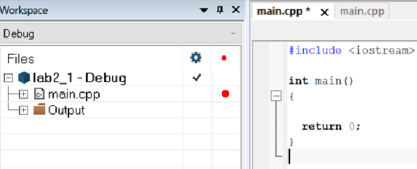

=== Переменная типа unsigned short

Создаем глобальную переменную типа *unsigned short* и присваиваем ей значение _65535._ Прибавляем к ней единицу.
Запускаем программу и открываем терминал через меню _View - Terminal I/O._

.Первый код
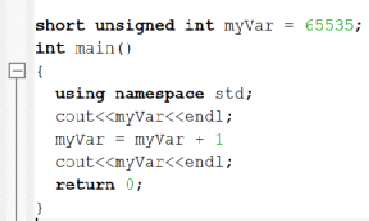

.Терминал
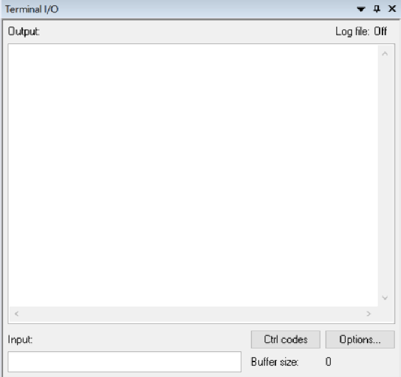
Наживаем *F10*, запускаем пошаговую отладку,следим за переменной *myVar*.

.Результат выполнения
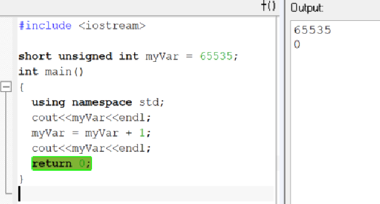
При добавлении единицы к переменной *myVar*, в результате работы программы, получаем _0_.
Это произошло из за переполнения переменной *unsigned short*, так как она не может хранить больше 2х байт, в двоичной системе отсчета это множество _2^16 = 65536_ чисел. Поскольку отсчет начинается с _0,_ то это множество от _0_ до _65535._
Поэтому при прибавление к _65535_ единицы, мы получаем несуществующее число в данном множестве, тоесть переполнение.
Следовательно получаем _0_.

=== Переменная *signed short*
Задание: _Поменять тип переменной на *signed short* и присвоить ей значение 32767. В функции main прибавить к данной переменной 1._
Полученный код представлен на рисунке.

.Код программы
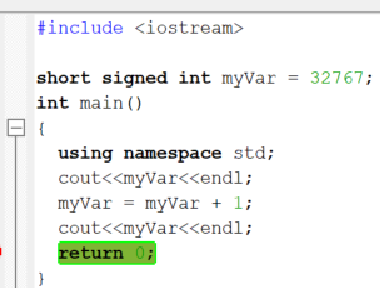

Запускаем пошаговую отладку и наблюдаем за изменением переменной.

.Результат программы
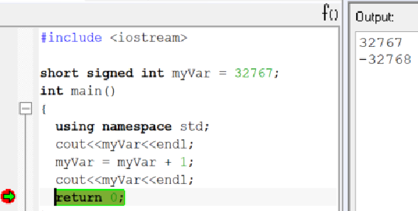

В результате число _32767_ при добавлении единицы стало _-32768_.

Снова произошло переполнение переменной ведь тип *short* может изменяться от _-32768_ до _32767_, здесь старший бит зарезервирован под знак числа(+++ или -). Так как произошло заполнение, число приняло максимально возможное отрицательное значение.

=== Вывод адреса в терминал
Задание: _"Не меняя тип переменной взять адрес переменной (оператор &) - вывести адрес переменной в терминал"._
Добавлям строку: *cout << &myVar << endl;*
Эта строка отвечает за вывод адреса переменной *myVar* в терминал. Запускаем отладку и проверяем результат результат:

.Вывод адреса в терминал
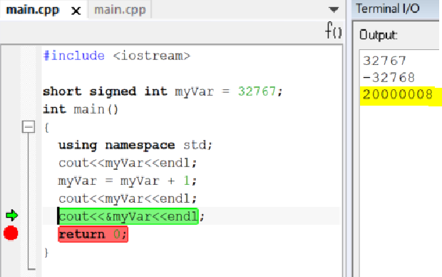
В окне терминала получаем адрес переменной: *0х20000008.*

=== Явное преобразование адреса переменной
Задание: _Не меняя переменной - явно преобразовать адрес переменной к типу указатель на short используя reinterpret_cast и присвоить локальной переменной типа short*._

*reinterpret_cast* — это операция приведения типов данных, позволяет интерпретировать значение в другой тип данных.

Добавим новую строку в код и запустим программу:

.Результат программы
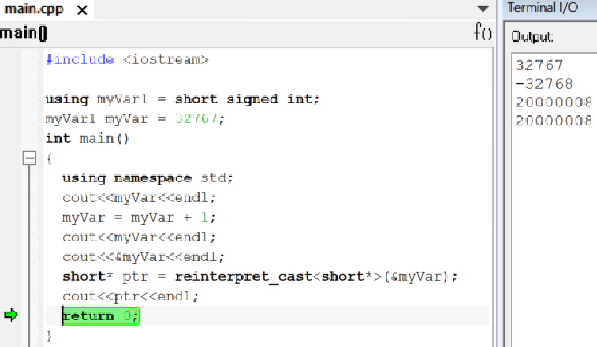

Выполнив программу можно сделать вывод:
адрес переменной и её указатель, который хранит этот адрес равны, так как *signed short* и *short* являются одним типом короткого целого числа со знаком.

Также было дано ещё одно задание с несколько изменным кодом:

.Результат работы программы
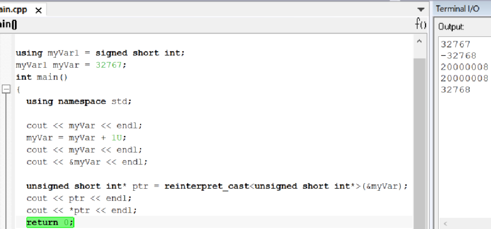
Выполнив программу получаем такой результат: к переменной *myVar* типа *signed short int* была добавлена единица, произошло переполнение, затем её значение было записано в указатель и явно преобразован в тип *unsigned short int*.
далее он был разыменован, но так как тип *unsigned short int* беззнаковый и принимает только положительные значения ( от _0_ до _65535_), получаем в окне значение _32768._

=== Разыменование указателя переменной
Задание: _Разыменовать указатель и вывести в терминал значение лежащее по адресу, указанному в указателе._
По адресу который хранится в указателе установим значение 2. Проверим, вопользовашись окном _Watch_ и окном _Memory_, вписав *ptr* в поле _Expression._ Затем проверим адрес 0x20000000 в окне _Memory_, чтобы узнать результат.

.Промежуточный этап программы
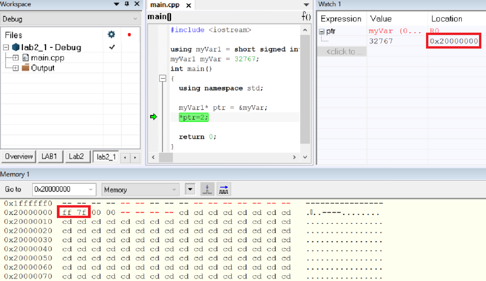

В данный момент по адресу _0x20000000_ хранится значение _32767_ в шестнадцатиричном формате _(32767 = 7fff)._
Закончив программу получаем такой результат:

.Результат программы
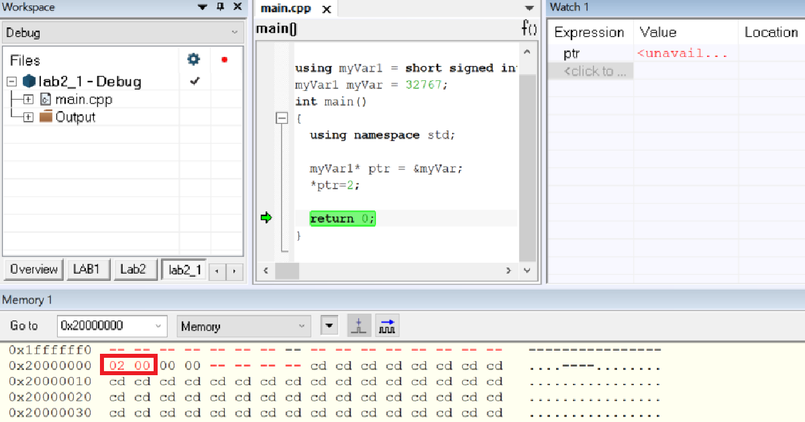
По итогу выполнения программы теперь по адресу _0x20000000_ хранится не значение переменной а его указатель равный _2._

Тперь необходимо произвести явное преобразование указателя к типу  *int,* для этого разыменуем его и выведем значение, которое лежит в адресе указателя.

Код на рисунке:

.ptr преобразуется в int
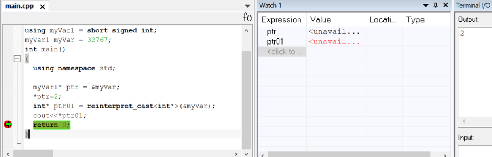
По результату работы программы получаем, что число _2_ принадлежит типу *int* и лежит по адресу указателя.

=== Работа с переменными short и unsigned short
Задание: _Заменить тип переменной с unsigned short на short и присвоить ей значение 65535._

.Результат
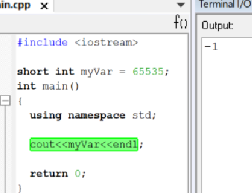
Получаем, что изменив тип на *short* и присвоив значение _65535_,  получим значение _-1_.
Это произошло птому что, как уже было сказано ранее, тип *short* может иметь максимальное положительное значение = _32767_ и изменяется в пределах от _-32768_ до _32767._
Отсюда получаем _65535=1+32767+32767_ следовательно, при таком значении переменная принимает максимальное значение, переполняется, принимает значение _-32768,_ затем к ней прибавляется ещё _32767,_ поэтому в терминале полчучается значение -1.

Задание: _Не меняя переменную в функции main сделать явное преобразование типа к short и объяснить результат._

Добавляем строку: *cout<<static_cast<short>(myVar)<<endl;*, запускаем программу и проверяем результат:

.Результат программы
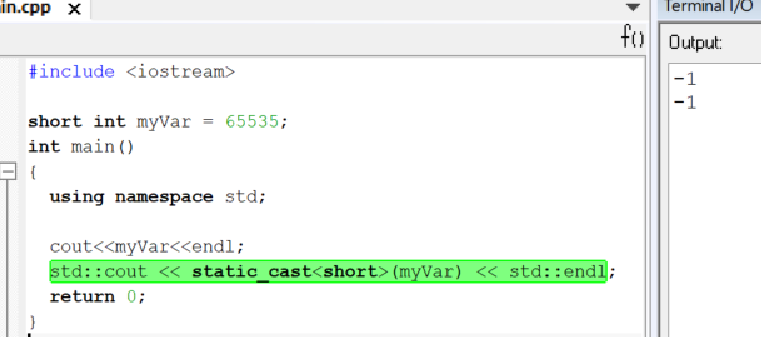
Этот результат получен в свзяи с тем, что производится преобразование к такому же типу данных, которым он являлся до преобразования, поэтому снова получаем значение _-1._
Теперь преобразуем переменную к типу *unsigned short,* изменив строку на *cout<<static_cast<unsigned short>(myVar)<<endl*;

.Результат программы
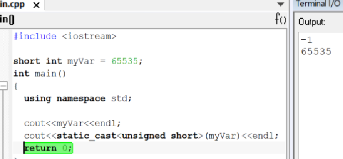
Теперь получили значение _65535._ Так как теперь переменная поменяла свой типа на *unsigned short*, а значит  её макимальное значение стало = _65535_, следовательно, теперь она может вместить значение переменной *myVar*, поэтому оно выводится в терминал.
Далее преобразуя переменную к типу *int* получим:

=== Переменная типа float
Задание: _Создать переменную типа float и присвоить ей значение _40'000'000'000f_; Прибавить к этому значению 1.0f, вывести значение в окно Watch и объяснить полученный результат_

.Результат программы
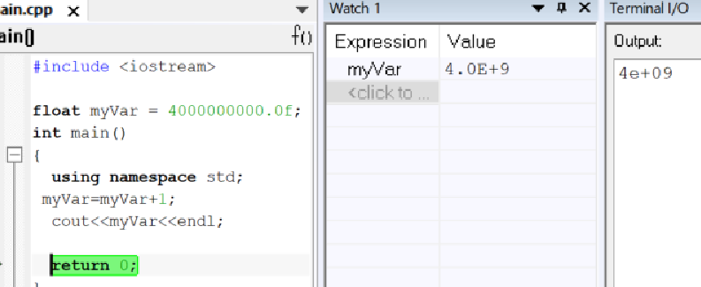
Выполнив программу , получаем следующее: после операции в программе в окнах значение переменной не изменилось, так как типу _float_ не хватает точности, чтобы показать такое значение.
Заменяем _float_ на _double_ и запускаем программу:

.Результат программы после смены типа переменной
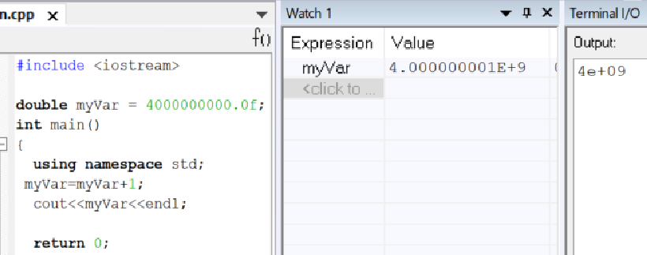
После сменны типа переменной значение в окнах стали отличаться, так как у _double_ точность в два раза выше чем у _float_ в окне _watch_ ставло возможным увидеть прибавленную единицу.

